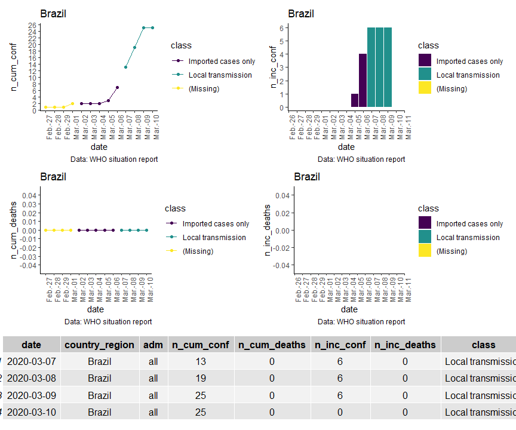
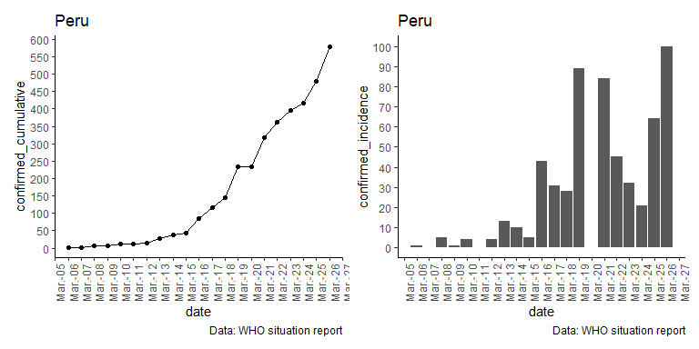

<!-- README.md is generated from README.Rmd. Please edit that file -->

# covid19viz

<!-- badges: start -->

[](https://www.tidyverse.org/lifecycle/#experimental)
[](https://cran.r-project.org/package=covid19viz)
[](https://zenodo.org/badge/latestdoi/246721190)
<!-- badges: end -->

The goal of `covid19viz` is to access and summarize WHO sitreps for
covid-19 in simple graphics.

This package works using two data repositories:

  - digitalized WHO sitreps by [Fabienne
    Krauer](https://twitter.com/FabiKrauer) available in
    [fkrauer/COVID-19](https://github.com/fkrauer/COVID-19).

  - Johns Hopkins University (JHU CSSE) available in
    [CSSEGISandData/COVID-19](https://github.com/CSSEGISandData/COVID-19).

## Installation

<!--
You can install the released version of covid19viz from [CRAN](https://CRAN.R-project.org) with:

``` r
install.packages("covid19viz")
```
-->

You can install the development version of `covid19viz` using:

``` r
if(!require("remotes")) install.packages("remotes")
remotes::install_github("avallecam/covid19viz")
```

## Quick Example

### with WHO sitreps

``` r
library(covid19viz)

# paste last update available at
# https://github.com/fkrauer/COVID-19
update <- "2020-03-10"

# apply
who_sitrep_country_report(
  update = update,
  country_region = "Brazil")
```



### with JHU collection

``` r
library(covid19viz)
library(tidyverse)

#import all data at once
jhu_sitrep_peru <- jhu_sitrep_all_sources(country_region="Peru")

jhu_sitrep_peru
#> # A tibble: 3 x 4
#>   country_region source    data_filter       sum_data
#>   <chr>          <chr>     <list>               <dbl>
#> 1 Peru           confirmed <tibble [65 x 7]>      580
#> 2 Peru           deaths    <tibble [65 x 7]>        9
#> 3 Peru           recovered <tibble [65 x 7]>       14

#transform to tidy format
jhu_sitrep_peru %>% 
  jhu_sitrep_all_sources_tidy() %>% 
  arrange(desc(confirmed_cumulative)) %>% 
  glimpse()
#> Observations: 65
#> Variables: 8
#> $ country_region       <chr> "Peru", "Peru", "Peru", "Peru", "Peru", "...
#> $ date                 <date> 2020-03-26, 2020-03-25, 2020-03-24, 2020...
#> $ confirmed_cumulative <dbl> 580, 480, 416, 395, 363, 318, 234, 234, 1...
#> $ deaths_cumulative    <dbl> 9, 9, 7, 5, 5, 5, 0, 3, 0, 0, 0, 0, 0, 0,...
#> $ recovered_cumulative <dbl> 14, 1, 1, 1, 1, 1, 1, 1, 1, 1, 0, 0, 0, 0...
#> $ confirmed_incidence  <dbl> 100, 64, 21, 32, 45, 84, 89, 0, 28, 31, 4...
#> $ deaths_incidence     <dbl> 0, 2, 2, 0, 0, 2, 0, 3, 0, 0, 0, 0, 0, 0,...
#> $ recovered_incidence  <dbl> 13, 0, 0, 0, 0, 0, 0, 0, 0, 1, 0, 0, 0, 0...
```

``` r
jhu_sitrep_country_report(country_region = "Peru")
```


